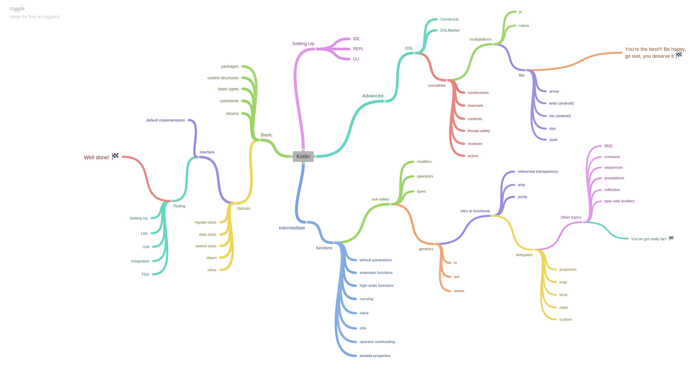

## Roadmap de estudos sobre Kotlin

Aqui consta o roadmap adotado pelo grupo de estudos de Kotlin.
A trilha está divida em três níveis: básico, intermediário e avançado.

Para dúvidas, críticas e/ou sugestões utilize o [Trello](https://trello.com/invite/b/tyvlJzIK/a5bd2cb7f505ef1a64de495151f3cee6/kotlin-roadmap) e nosso canal **#kotlin-studies** no [Slack do Training Center](https://github.com/training-center/slack)

Abaixo se encontra compilado o roadmap de estudos (última atualização em 19/09/2018):
